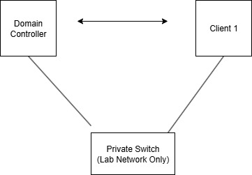

# Lab: Windows Server 2012 Domain Controller Setup

**VM Name:** `DC01`  
**OS:** Windows Server 2012 Standard  
**Role:** Primary Domain Controller  
**Lab Network:** Private Virtual Switch  
**IP Address (Planned):** 10.0.0.10/24 (Static)

## Tasks Completed

- Installed Windows Server 2012 on Hyper-V VM  
- Renamed computer from default to `DC01`  
- Planning to assign static IP next  

## Next Steps

- Set static IP to `10.0.0.10`  
- Install DNS and AD DS roles  
- Promote to domain controller  
- Test with a client VM
  
   

 
